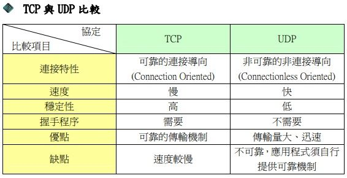

# computer netwokr計算機網路   網路概論

# 說明OSI Model與 TCP/IP protocol
# 七層OSI模型
```
第7層 應用層（Application Layer）
第6層 表達層（Presentation Layer）
第5層 會議層（Session Layer）
第4層 傳輸層（Transport Layer）
第3層 網路層（Network Layer）
第2層 資料連結層（Data Link Layer）
第1層 實體層（Physical Layer）
```
# TCP IP
```
網際網路協議套組（英語：Internet Protocol Suite，縮寫為IPS），是一個網路通訊模型，以及一整個網路傳輸協定家族，為網際網路的基礎通訊架構。
4應用層（OSI5到7層）
例如HTTP、FTP、DNS（如BGP和RIP這樣的路由協定，儘管由於各種各樣的原因它們分別運行在TCP和UDP上，仍然可以將它們看作網路層的一部分）
3傳輸層
（OSI4層）例如TCP、UDP、RTP、SCTP（如OSPF這樣的路由協定，儘管運行在IP上也可以看作是網路層的一部分）
2網路互連層
（OSI3層）對於TCP/IP來說這是網際網路協定（IP）（如ICMP和IGMP這樣的必須協定儘管運行在IP上，也仍然可以看作是網路互連層的一部分；ARP不運行在IP上）
1網路介面層
（OSI1和2層）例如乙太網、Wi-Fi、MPLS等。
```

# 何謂communcation protocol[簡稱協定protocol]?
```
通信協定（英語：Communications Protocol，也稱傳輸協定）在電信領域中指的是，在任何物理媒介中允許兩個或多個在傳輸系統中的終端之間傳播資訊的系統標準，也是指電腦通信或網路裝置的共同語言。
```
# WHY Layering為何要分層?
```
OSI七層模型之所以要對網路分層，主要是在網路通訊的整個過程中，將整個流程細化開來，每一層完成各自的事情，互不干擾。
OSI七層是誰制定的:國際標準組織(International Organization for Standardization)簡稱ISO於1984年制定OSI(Open System Interconnection)網路參考模型
優點:
1.降低複雜的程度，使得程式更容易修改，加快產品的研發速度
2.分層負責，每層都有屬於自己的工作
3.提供網路標準
4.易於理解整體架構
```
# 各種協定
```
簡述下列協定protocol須回答
(A)英文全名
(B)運作在那一層?
(C)主要功能
(D)相關工具或伺服器
```
### application層
```
HTTP vs HTTPS
```
http與https差異  https://www.webdesigns.com.tw/HTTPorHTTPS.asp

HTTP與HTTPS的差別不單單只是1個英文字S的差異，這僅一個字母S的差別卻代表了網站使用編碼協定的安全性(secure)，http://跟https://之間的不同在於網路文字傳送協定中標準的不同

https開始的網址會多顯示"安全"標示，讓您簡單的瞭解網站對於使用者的友善性。

http

是網頁與您的電腦瀏覽器直接透過明文進行傳輸，以一般(非安全)模式下進行互動交談，所以在網際網路上內容有可能遭攔有心人士截竊聽的，HTTP協定不使用加密協定，其中原因包含：加密會多消耗許多運算資源，也會佔用更多的傳輸頻寬，而緩存機制跟著會失效。

HTTPS協定

以保密為前提為研發，可以算是HTTP的進階安全版。是以加入SSL協定作為
安全憑證，因此網站透過協定上的加密機制後能夠防止資料竊取者就算攔截到了傳輸資訊卻也無法直接看到傳輸中的資料，也因此較大型有串聯金融信用機制會使用到較敏感度資料的企業網站多會選擇使用HTTPS協定，提供保障客戶在網站上的使用資訊。
```
FTP vs SFTP | FTPS
```
原文網址：https://kknews.cc/tech/mmxyvkg.html

FTP 是File Transfer Protocol（文件傳輸協議）

兩個概念：」下載」（Download）和」上傳」（Upload）。」

FTP也是一個客戶機/伺服器系統。用戶通過一個支持FTP協議的客戶機程序，連接到在遠程主機上的FTP伺服器程序。用戶通過客戶機程序向伺服器程序發出命令，伺服器程序執行用戶所發出的命令，並將執行的結果返回到客戶機。比如說，用戶發出一條命令，要求伺服器向用戶傳送某一個文件的一份拷貝，伺服器會響應這條命令，將指定文件送至用戶的機器上。客戶機程序代表用戶接收到這個文件，將其存放在用戶目錄中。

Ftps

加密版的FTP，當你在FTP伺服器上收發文件的時候，你面臨兩個風險。第一個風險是在上載文件的時候為文件加密。第二個風險是，這些文件在你等待接收方下載的時候將停留在FTP伺服器上，這時你如何保證這些文件的安全。

Sftp

Sftp是Secure File Transfer Protocol的縮寫，安全文件傳送協議。可以為傳輸文件提供一種安全的加密方法。sftp 與 ftp 有著幾乎一樣的語法和功能。SFTP 為 SSH的一部分，是一種傳輸檔案至 Blogger 伺服器的安全方式。

FTPS 和 SFTP 的區別

FTPS 和 SFTP 都是為ftp連接加密，協議非常相似。

一個是藉助ssl協議加密，一個時藉助ssh加密。

ssl是為http/smtp等加密設計的，ssh是為telnet/ftp等加密、建立傳輸通道而設計的。

FTP 和 SFTP 的區別

文件傳送協議FTP(File Transfer Protocol)是TCP/IP協議簇中的一個成員，也是現在網際網路上最廣泛的文件傳送協議。FTP協議包括兩個部分，一個是FTP客戶端，另一個是FTP伺服器。當然，FTP伺服器是用來存儲文件資源的，FTP客戶端通過訪問FTP伺服器來獲得資源的。

```
TELNET vs SSH
```
https://akikazeshao.gitbooks.io/note/content/ssh_he_telnet_lian_xian_fang_shi_yu_bi_jiao.html

telnet：執行Telnet程式來連線到遠端伺服器並輸入帳密讓使用者可以遠端控制主機。但是因為傳輸的資料並未加密所以容易遭到竊取，因此後來多改用較安全的SSH。

SSH：是在不安全的網路上進行安全遠端登入和其他安全網路服務的協定(RFC 4251)，SSH由三個主要協定組成

1.傳輸層協定（The Transport Layer Protocol）：傳輸層協定提供伺服器認證，資料機密性，資訊完整性等的支援。
傳輸層協定運行在TCP連線上。

2.使用者認證協定（The User Authentication Protocol）：使用者認證協定為伺服器提供客戶端的身份鑑別。
使用者認證協定運行在傳輸層協定之上。

3.連線協定（The Connection Protocol）：連線協定將加密的資訊隧道復用成若干個邏輯通道，提供給更高層的應用協定使用。
連線協定運行在使用者認證協定之上。

SSH的安全驗證( 取自維基 )

在客戶端來看，SSH提供兩種級別的安全驗證。

第一種級別（基於密碼的安全驗證），知道帳號和密碼，就可以登入到遠端主機，並且所有傳輸的資料都會被加密。但是，可能會有別的伺服器在冒充真正的伺服器，無法避免被「中間人」攻擊。

第二種級別（基於金鑰的 安全驗證），需要依靠金鑰(SSH Key)，也就是你必須為自己建立一對金鑰，並把公有金鑰放在需要存取的伺服器上。客戶端軟體會向伺服器發出請求，請求用你的金鑰進行安 全驗證。伺服器收到請求之後，先在你在該伺服器的使用者根目錄下尋找你的公有金鑰，然後把它和你傳送過來的公有金鑰進行比較。如果兩個金鑰一致，伺服器就 用公有金鑰加密「質詢」（challenge）並把它傳送給客戶端軟體。從而避免被「中間人」攻擊。

```
SMTP vs POP3 INAP 4
```
原文網址：https://kknews.cc/code/a4k2k5g.html

POP（Post Office Protocol）

郵局通訊協定POP是網際網路上的一種通訊協定，主要功能是用在傳送電子郵件，當我們寄信給另外一個人時，對方當時多半不會在線上，所以郵件伺服器必須為收信者保存這封信，直到收信者來檢查這封信件。當收信人收信的時候，必須通過POP通訊協定，才能取得郵件。

SMTP(Simple Mail Transfer Protocol)

簡易郵件傳輸通訊協議 SMTP是網際網路上的一種通訊協議，主要功能是用在傳送電子郵件，當我們通過電子郵件程序，寄E-mil給另外一個人時，必須通過SMTP通訊協議，將郵件送到對方的郵件伺服器上，等到對方上網的時候，就可以收到你所寄的信。

POP3是Post Office Protocol 3

的簡稱，即郵局協議的第3個版本,是TCP/IP協議族中的一員（默認埠是110）。本協議主要用於支持使用客戶端遠程管理在伺服器上的電子郵件。

```
DNS vs DNSsec
```
https://blog.twnic.tw/2020/02/27/6205/

DNS（Domain Name System）

DNSSEC（Domain Name System Security Extensions）

```
DHCP
```

動態主機設定協定（英語：Dynamic Host Configuration Protocol，縮寫：DHCP）又稱動態主機組態協定

是一個用於IP網路的網路協定，位於OSI模型的應用層，使用DHCP協定工作，主要有兩個用途： 用於內部網路或網路服務供應商自動分配IP位址給用戶 用於內部網路管理員對所有電腦作中央管理

```
LDAP
```
https://zh.wikipedia.org/wiki/%E8%BD%BB%E5%9E%8B%E7%9B%AE%E5%BD%95%E8%AE%BF%E9%97%AE%E5%8D%8F%E8%AE%AE

輕型目錄存取協定（英文：Lightweight Directory Access Protocol，縮寫：LDAP

通過IP協定提供存取控制和維護分散式資訊的目錄資訊。

```
SAMBA
```
Samba，是種用來讓UNIX系列的作業系統與微軟Windows作業系統的SMB/CIFS（Server Message Block/Common Internet File System）網路協定做連結的自由軟體。
```
SNMP
```
https://www.manageengine.com/tw/network-monitoring/what-is-snmp.html

簡易網路管理通訊協定 (SNMP) ，是由網際網路架構委員會 (IAB) 在 RFC1157 中定義的應用程式層通訊協定，用於交換網路裝置之間的管理資訊。它是傳輸控制通訊協定/網際網路通訊協定 (TCP⁄IP) 通訊協定組合的一部分。

SNMP 是用於管理和監視網路元素的廣泛接受的通訊協定之一。大多數專業級網路元素都具有配套的 SNMP 代理程式。必須啟用并設定這些代理程式，以與網路管理系統 (NMS) 進行通訊。

```
RTMP RTSP
```
1，RTMP協議
（1）是流媒體協議。
（2）RTMP協議是 Adobe 的私有協議，未完全公開。
（3）RTMP協議一般傳輸的是 flv，f4v 格式流。
（4）RTMP一般在 TCP 1個通道上傳輸命令和資料。

2，RTSP協議
（1）是流媒體協議。
（2）RTSP協議是共有協議，並有專門機構做維護。.
（3）RTSP協議一般傳輸的是 ts、mp4 格式的流。
（4）RTSP傳輸一般需要 2-3 個通道，命令和資料通道分離。

通常我們進行 RTMP/RTSP 開發時，除了可以自己搭建視訊伺服器來進行測試外。也可以直接使用一些電視臺的直播地址，省時省力。
```
MQTT
```
MQTT[1]訊息佇列遙測傳輸（英語：Message Queuing Telemetry Transport）資料傳遞的橋梁

MQTT 協定使用普通文字傳送連接認憑證，且並不包含任何安全或認證相關的措施。但可以使用傳輸層安全來加密並保護髮送的資料，以防止攔截、修改或偽造。
```
### transport層
# TCP 與UDP的差異

```
TCP(Transmission Control Protocol)
   這個協定最主要的特色在於傳輸資料時，需要驗證資
料，確保正確性。所以花的時間稍多一點。
UDP(User Datagram Protocol)
   這個協定最主要的特色在於傳輸資料時，不需要驗
證資料，不保證正確性，所以比較省時間。而一般來說，
像是多媒體串流(streaming)就是使用這種協定。
```
# [1]須說明reliable(可靠) vs un-reliable(不可靠)
```
TCP
TCP的優點： (可靠)，穩定 TCP的可靠體現在TCP在傳遞數據之前，會有三次握手來建立連接，而且在數據傳遞時，有確認、窗口、重傳、擁塞控制機制，在數據傳完後，還會斷開連接用來節約系統資源。
TCP的缺點： (不可靠)慢，效率低，占用系統資源高，易被攻擊 TCP在傳遞數據之前，要先建連接，這會消耗時間，而且在數據傳遞時，確認機制、重傳機制、擁塞控制機制等都會消耗大量的時間，而且要在每台設備上維護所有的傳輸連接，事實上，每個連接都會占用系統的CPU、內存等硬體資源。
原文網址：https://kknews.cc/code/l42exp2.html
UDP
UDP的優點： 快，比TCP稍安全 UDP沒有TCP的握手、確認、窗口、重傳、擁塞控制等機制，UDP是一個無狀態的傳輸協議，所以它在傳遞數據時非常快。沒有TCP的這些機制，UDP較TCP被攻擊者利用的漏洞就要少一些。
```
# [2]如何達到reliable(可靠)
```
```
# (A)錯誤重傳
```
重送 (Retransmission)
一旦 連線建立，TCP 以 區段 (segment) 的交換來傳遞資料。
接收端 可能因「檢驗和測試失敗」，認定區段毀損並丟棄，
或 網路壅塞… 等因素，而遺失區段，
TCP 使用 重送 (Retransmission) 機制，確保每個 區段 的傳遞。
大部分的 TCP 實作，將區段的 —
毀損 (damaged)、遺失 (lost)、延遲 (delayed) 視為相同情況，
差別在於 毀損的區段 由 接收端 丟棄，而 遺失的區段 由 網路的某處丟棄。 
常見的重送機制有兩種:
逾時重送 (Retransmission Timeout, RTO)
快速重送 (Fast Retransmit)
```
# (B) ThreeWay Handshaking
```
是其建立虛擬連線 (virtual connection) 的方式。
又稱為 三向式握手、三路交握 …，其實就是 三次訊息的交換。
```
# [3]封包格式 TCP format   vs UDP format 
```
```
### 
```
IP vs IPsec
ICMP
```
### 連結層
```
ARP
```
# 網路硬體設備 Network Devices
```
簡述底下網路設備:須說明
(A)運作在OSI那一層?
(B)主要功能

(1) HUB  vs Repeater
(2) Switch vs Bridge
(3) Router
(4) L4 Switch
(5) Proxy 
```
```
名詞解釋: VLAN
```
# 各種address位址
```
PORT address
IP address
MAC address
```
